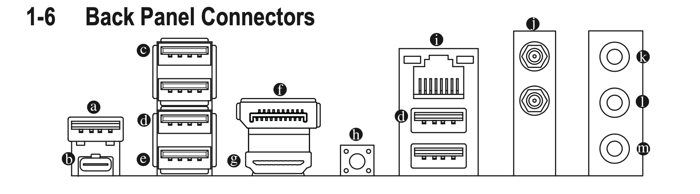

## Back panel (Gigabyte z490i Aorus Ultra)

* a=a_USB32_Gen2_TypeA_Red
	* USB 3.2 Gen 2 Type-A Port (Red)
	* HS03, SS05 (SS02)

* c=c_USB20_top HS11
* c=c_USB20_top HS12

* d=d_USB31_Gen_1_top **HS08** ~~HS06~~, **SS08** (SS02)
	* USB 3.2 Gen 1 Port
* e=d_USB31_Gen_1_bottom ~~HS05~~_more likely:_ **HS07**, SS07 (SS02)
	* USB 3.2 Gen 1 Port

* d(below ethernet top)=HS02, SS03 (SS02)
* d(below ethernet bottom)= **HS03** ~~HS01~~,**SS03** (SS02)

* b = **HS06, SS06** ~~SS08 (SS02)~~

## Front panel (NZXT H1 case; both connected to motherboard)
* USB Type A = HS08, SS10

* USB Type C **HS01/SS01**
	* Samsung T5 = SS01 (SS02)
	* iPadPro = HS01, ~~SS03~~ (SS02)

### Note on USB-C types
> USB type C ports can be either 9 or 10, which depends on how the hardware deals with the two possible orientations of a USB type C device/cable.
> If a USB-C uses the same SSxx in both orientations, then it has an internal switch (UsbConnector=9).
> If a USB-C uses a different SSxx in each orientation, then it has no switch (UsbConnector=10).

